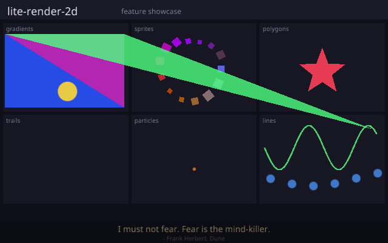

# lite-render-2d

A 2D renderer in Rust. It batches everything you draw into one vertex buffer and puts it on screen in a single draw call. 100k sprites runs over 100fps in one draw call and adds under 10MB of RAM. Instanced draws go out in zero draw calls.

It does a lot more than shapes. What is in it right now.

- Rects, rounded rects, circles, lines and dashed lines, filled or stroked, plus a path tessellator for arbitrary polygons and an SVG path parser on top of it.
- Sprites, sprite sheets and a texture atlas so a whole sheet binds once.
- SDF fonts that stay sharp at any scale, bitmap fonts, and a rich text layer.
- Particles, trails, tilemaps, and a 2D camera with pan and zoom.
- A transform stack. Push, draw, pop, and everything inside is moved and scaled with it.
- Post processing passes, input handling, and a bit of audio.

Two backends sit behind one trait, OpenGL ES 3 through glow and wgpu, glow by default. Your code is the same over either. Most modules carry their own tests.

## Numbers

NVIDIA MX450, 800x600, vsync off.

| sprites | fps | draw calls | RAM over baseline |
|---|---|---|---|
| 10,000 | 861 | 1 | 1 MB |
| 100,000 | 108 | 1 | 9 MB |
| 250,000 | 44 | 1 | 23 MB |
| 500,000 | 22 | 1 | 46 MB |

Holds 60fps to about 150k sprites and 30fps to about 350k, always one draw call.

## Quick start

    let mut ren = GlowRenderer::new(&window)?;
    ren.begin_frame()?;
    ren.draw_rect(Rect::new(50.0, 50.0, 200.0, 100.0), DrawParams::fill(Color::RED));
    ren.end_frame()?;

examples/hello.rs is the full version, one example per feature next to it.

## Status

In progress, like the rest of my stuff. Everything above works and is what i use it for. Not on crates.io yet.
